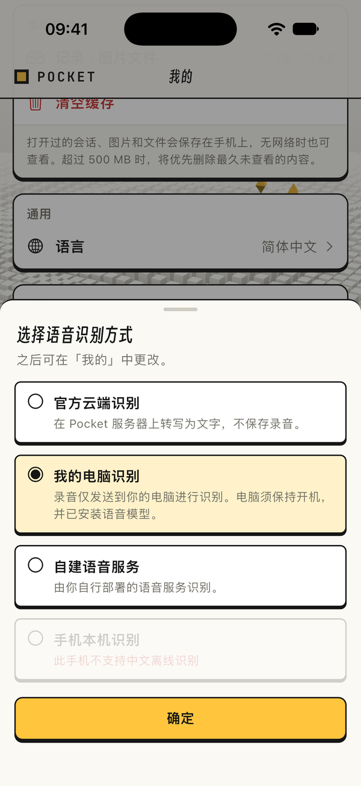

# pocket-asr

[English](README.md) | 简体中文

[Pocket](https://pocket.pocketcli.net) 的语音识别网关。它是一个 HTTPS 接口,后面接你选的识别引擎:跑在你自己服务器上的模型,或者用你自己 Key 的云服务。它只回文字,**录音和文字都不保存。** Node.js 22 以上,不依赖任何 npm 包,许可是 AGPL-3.0-only。

## 最简单的方式:用自己的电脑识别

不用部署服务器。电脑上装着 Pocket,就能让这台电脑把你的语音转成文字。

1. 在电脑上点菜单栏(Mac)或任务栏通知区域(Windows)里的 Pocket 图标,选「安装语音识别（约 180 MB）…」。只需装一次:识别模型和识别程序共约 180 MB,一般一分钟左右装好,进度显示在菜单里。
2. 在 Pocket App 里打开 **我的 → 语音识别方式**,选 **我的电脑识别**,点 **确定**。

<p align="center"></p>

- **适合谁**:不想自己部署服务器的人。这种方式用不到本仓库;本仓库是在自己的服务器上部署语音服务用的(见下文)。
- **前提**:电脑上装着 Pocket 电脑端,并已和手机配对。支持 macOS(Apple 芯片或 Intel)和 Windows(x64)。
- **隐私**:录音只在你的手机和你的电脑之间传,全程端到端加密。电脑不保留录音,识别出的文字像打字一样发进会话。
- **限制**:电脑要开着、在线;不在线时,App 里这一项是灰的,并写明原因。支持中文和英文。

## 一条命令部署(推荐)

要一台有公网 IP 的 Ubuntu 或 Debian 服务器(x86_64 或 arm64,systemd)。这条命令把语音服务和[中继 pocket-relay](https://github.com/pocketcli-app/pocket-relay)一起装好,不用域名,也不用买证书、续证书:

```sh
# 国内版(用国内版 Pocket App 的,一般选这个)
curl -fsSL https://api.pocketcli.cn/dl/selfhost/install.sh | sudo bash

# 国际版
curl -fsSL https://pocket.pocketcli.net/dl/selfhost/install.sh | sudo bash

# 只装语音服务
curl -fsSL https://api.pocketcli.cn/dl/selfhost/install.sh | sudo bash -s -- --asr-only
```

脚本在需要时装好 Node.js 22,每个下载都按 SHA-256 核对,以 `pocket-asr` 服务常驻,等语音模型下载完(约 190 MB,只在第一次),最后打印这样一行:

```
  pocket-asr://203.0.113.7:8444?pin=sha256:3c9f…e41b&token=pXq…7Kd
```

1. 在 Pocket App 里打开 **我的 → 语音识别方式 → 自建语音服务**,粘贴这一行。
2. 在云服务器控制台的防火墙 / 安全组里放行 **TCP 8444**(默认是关的;机器上开着 ufw 时脚本已经放行)。

这一行里的访问密钥(`token`)**只显示这一次**,数据目录里只存哈希,日志里也没有。丢了,或者想每台手机一个,运行 `sudo pocket-asr new-token "我的 iPad"`。升级 = 重新运行同一条命令(证书、访问密钥、模型都保留);卸载:`… | sudo bash -s -- --uninstall`。自己的设置写在 `/etc/pocket-asr/env`(例如 `ASR_PUBLIC_URL=https://203.0.113.7:8444`),改完 `systemctl restart pocket-asr`。照下面的办法手动装过的(`/opt/pocket-asr`、服务名 `pocket-asr`、数据在 `/var/lib/pocket-asr`),脚本会接管,数据不丢。

**国内版和国际版。** Pocket 分国内版(`api.pocketcli.cn`)和国际版(`pocket.pocketcli.net`)两套服务。国内版(`ASR_EDITION=cn`)只向 `https://api.pocketcli.cn` 查公网地址,语音模型和识别程序只从 `https://api.pocketcli.cn/dl/asr/` 下载,不试 GitHub、Hugging Face,除了你自己配的云端引擎,不连任何境外地址。那里放着默认模型和 Linux 版 sherpa-onnx,其他模型要自己下载放进去。国际版(`ASR_EDITION=intl`,默认)先试 `https://pocket.pocketcli.net/dl/asr/`,再试原地址。

`pin` 是网关证书的 SHA-256,App 只认这一张证书,中间谁也冒充不了网关。`token` 是让手机进门的访问密钥。

**服务器配置。** 默认引擎用服务器自己的 CPU,磁盘约占 0.3 GB。每个正在识别的请求约占 0.5 GB 内存(内存不到 1.8 GB 时一次识别一个,否则两个)。一个人用 1 核 1 GB 就够,一句话几秒出字。机器再小,就用云端引擎和 `slim` 镜像(见[引擎与模型](#引擎与模型))。

## 其他部署方式

### Docker

```sh
curl -fsSL https://api.pocketcli.cn/dl/selfhost/install.sh | sudo bash -s -- --docker /opt/pocket-docker   # 国际版换成 pocket.pocketcli.net
cd /opt/pocket-docker && docker compose up -d --build        # 中继和语音服务一起起;版本写在 .env 里
docker compose logs -f pocket-asr
```

或者直接从仓库构建:

```sh
git clone https://github.com/pocketcli-app/pocket-asr && cd pocket-asr
docker build -t pocket-asr .                    # 国内版:--build-arg ASR_EDITION=cn --build-arg APT_MIRROR=mirrors.aliyun.com
docker run -d --name pocket-asr --restart unless-stopped -p 8444:8444 -v pocket-asr:/var/lib/pocket-asr pocket-asr
docker logs -f pocket-asr
```

第一次启动时,网关下载语音模型(约 160 MB,按 SHA-256 核对),生成证书和一个令牌,然后打印那一行(用 Docker 时令牌会留在 `docker logs` 里,介意就作废它、再要一个)。国内拉 Docker Hub 的基础镜像(`node:22`)很慢甚至拉不下来,要先给 Docker 配镜像加速器,或者用上面的一条命令部署。

网关问 Pocket 协调服务器「我的请求从哪个 IP 来」。问不到或者不对(比如在 NAT 后面)时,这一行里是 `<this-server-public-IP>`,旁边会说明。把它换掉,或者设好地址重启:

```sh
docker run … -e ASR_PUBLIC_URL=https://203.0.113.7:8444 … pocket-asr
```

映射到别的端口(`-p 443:8444`)时也要设:`-e ASR_PUBLIC_URL=https://203.0.113.7:443`。

### 不用 Docker、不用脚本

Node.js 22 以上;Linux x64 或 arm64(glibc),或 macOS:

```sh
git clone https://github.com/pocketcli-app/pocket-asr /opt/pocket-asr
sudo useradd --system --create-home --home-dir /var/lib/pocket-asr pocket-asr
sudo -u pocket-asr node /opt/pocket-asr/src/main.mjs       # 第一次启动:复制那一行,然后 Ctrl-C(国内版加 ASR_EDITION=cn)
```

第一次启动还会把 sherpa-onnx 程序(约 30 MB)装进数据目录。要让它常驻,把下面这段存成 `/etc/systemd/system/pocket-asr.service`,再跑 `systemctl enable --now pocket-asr`(那一行在 `journalctl -u pocket-asr` 里):

```ini
[Unit]
Description=pocket-asr speech gateway
After=network-online.target
Wants=network-online.target

[Service]
User=pocket-asr
ExecStart=/usr/bin/node /opt/pocket-asr/src/main.mjs
Restart=always

[Install]
WantedBy=multi-user.target
```

[运维](#运维)里的命令用同一个用户跑:`sudo -u pocket-asr node /opt/pocket-asr/src/main.mjs new-token`。换数据目录就设 `ASR_DATA_DIR=/路径`,服务和命令都要带。

### 有域名时

**前面套反向代理**(有域名时最省事)。Caddy 自己申请、续期证书:

```
asr.example.com {
    reverse_proxy 127.0.0.1:8444
}
```

```sh
docker run -d --name pocket-asr --restart unless-stopped -p 127.0.0.1:8444:8444 -v pocket-asr:/var/lib/pocket-asr \
  -e ASR_TLS=off -e ASR_PUBLIC_URL=https://asr.example.com pocket-asr
```

这时网关和代理之间走明文 HTTP,那一行里没有 `pin`(`pocket-asr://asr.example.com:443?token=…`)。App 照常检查代理的证书,续期不受影响。不用 Docker 时监听回环就行:配置里写 `"listen": {"host": "127.0.0.1"}` 和 `"publicUrl"`(只听回环时默认就是明文 HTTP)。也可以带路径前缀:`ASR_PUBLIC_URL=https://example.com/asr`,代理不去掉前缀时再加 `"basePath": "/asr"`。

**证书文件**:`"tls": {"cert": "/etc/letsencrypt/live/asr.example.com/fullchain.pem", "key": "…/privkey.pem"}` 加 `"publicUrl": "https://asr.example.com:8444"`。证书文件在启动时读取,续期后要重启(比如 certbot 的 `--deploy-hook "docker restart pocket-asr"`)。公共证书机构签给域名的证书,那一行里不带 `pin`;自签的,或者签给 IP 的,带。

## 网关留下什么、往外发什么

Pocket 的语音有四种识别方式,这个网关负责其中两种:

| 识别方式 | 录音去哪 |
|---|---|
| 官方云端 | 手机 → 官方网关(就是这份代码,Pocket 运行)→ 云端识别服务 |
| 我的电脑 | 手机 →(端到端加密)→ 你的电脑,用本仓库同一套本地引擎识别(`src/engines/local.mjs`) |
| **自建语音服务** | 手机 → **你的** pocket-asr → 你配置的引擎 |
| 手机本机 | 不出手机(iOS / Android 系统自带的离线识别) |

- 录音和文字只在这一次请求的内存里。本地引擎用一个临时文件,回答之前就删掉。
- 每个请求一行日志:时间、网关 ID、调用方(令牌标签或账号 ID)、引擎、音频秒数、字数、耗时、结果码(出错时加一个内部原因或服务商的请求 ID)。**绝不记**录音、文字、令牌、票据、签名。服务商的出错原文也不记,有的会带出 Key 的片段。
- 没有统计。网关只连:你配置的引擎;你要它下载的东西(以及第一次启动时默认引擎的下载);Pocket 协调服务器,没设 `publicUrl` 时问这台服务器的公网 IP(`GET /v2/whoami`,它只看得到请求从哪个地址来),开了票据认证时取公钥和撤销名单。
- 用云端引擎时,录音会以你的账号交给那家服务商。

## 引擎与模型

**默认:本地识别。** 配置里没有 `engines` 时,网关用 [sherpa-onnx](https://github.com/k2-fsa/sherpa-onnx) + SenseVoice small(int8;中文和英文,`zh` / `en` / `auto`)在服务器自己的 CPU 上识别,不要 Key,录音不出你的服务器。Docker 镜像里带了程序,模型在第一次启动时下载到数据目录。不用 Docker 时两样都放在数据目录里(`<dataDir>/sherpa-onnx`、`<dataDir>/models/sense-voice-int8`)。`ASR_SHERPA_BIN` 可以指向你自己装的程序。

**换别的引擎**要一个配置文件(容器里是 `/etc/pocket-asr/asr.json`,或者 `--config <文件>`)。最小的例子是一家云服务,Key 放在环境变量里:

```json
{ "engines": [ { "id": "openai", "type": "openai", "apiKey": "env:OPENAI_API_KEY" } ] }
```

```sh
docker build --target slim -t pocket-asr:slim .          # 只用云端引擎:镜像更小,不带本地程序
docker run -d --name pocket-asr --restart unless-stopped -p 8444:8444 -v pocket-asr:/var/lib/pocket-asr \
  -v $PWD/asr.json:/etc/pocket-asr/asr.json:ro -e OPENAI_API_KEY=sk-… pocket-asr:slim
```

`"env:变量名"` 从环境变量读,`"file:/路径"` 从文件读,秘密不用写进配置。`"secretsFile": "/路径.json"` 把一个 JSON 凭据文件合并进引擎设置。可以配多个引擎,`"default": {"zh": "<id>", "en": "<id>", "auto": "<id>"}` 按语言指定;不指定就用第一个支持该语言的。

| `type` | 服务 | 设置 | 语言 | 上限 |
|---|---|---|---|---|
| `volcano` | 火山引擎 大模型语音识别,WebSocket `bigmodel_nostream` | `appId`、`accessToken`、`resourceId`?、`hotWords`?、`url`? | zh、en、auto | 240 秒 |
| `alibaba` | 阿里云 一句话识别 | `accessKeyId`、`accessKeySecret`、`appkey` 或 `appkeys: {zh, en}`、`region`?(`cn-shanghai`) | 看 appkey | 60 秒 |
| `tencent` | 腾讯云 一句话识别(SentenceRecognition,TC3 签名) | `secretId`、`secretKey`、`region`?、`engines`?(`{zh: "16k_zh", en: "16k_en", auto: "16k_zh-PY"}`) | zh、en、auto | 60 秒 |
| `iflytek` | 讯飞 语音听写 WebAPI v2 | `appId`、`apiKey`、`apiSecret`、`languages`? | zh、en | 60 秒 |
| `openai` | OpenAI(或兼容接口)`/audio/transcriptions` | `apiKey`、`model`?(`gpt-4o-transcribe`)、`baseUrl`?(`https://api.openai.com/v1`) | zh、en、auto | 600 秒 |
| `deepgram` | Deepgram 录音识别 `/v1/listen` | `apiKey`、`models`?(`nova-3`) | zh、en、auto | 600 秒 |
| `azure` | Azure AI Speech 短音频 REST | `key`、`region` 或 `endpoint`、`languages`? | zh、en | 60 秒 |
| `sherpa-onnx` | 本地:`sherpa-onnx-offline` + SenseVoice 或 Paraformer | `bin`、`model`(目录)、`threads`? | SenseVoice zh/en/auto,Paraformer zh | 240 秒 |
| `whisper.cpp` | 本地:`whisper-cli` | `bin`、`model`(ggml 文件)、`threads`? | zh、en、auto | 240 秒 |
| `vosk` | 本地:`vosk-transcriber` 或 `scripts/vosk-wav.py` | `bin`、`model`(目录)、`langs` | 看模型 | 240 秒 |

每个引擎还可以设 `maxSeconds`(低于它自己的上限)。**本地引擎**每个请求起一次外部程序,用参数数组,不经过 shell;Windows 上经 `cmd.exe` 起、每个参数都加引号,因为 bun 编的程序直接起它会卡好几秒。录音写进一个私有临时目录(0700),回答之前删掉;超时或调用方断开时杀掉程序。本地引擎加上 `"install": {"model": "<id>"}`,缺模型时启动会自动下载。`models.json` 列出能装的程序和模型,每个文件都有大小和 SHA-256:

| 模型 | 引擎 | 大小 | |
|---|---|---|---|
| `sense-voice-int8` | sherpa-onnx | 155 MB | 默认。同样的 CPU 时间里中文最准,也能识别英文,带标点。用的是 2024-07-17 那一版(2025-09-09 那一版是粤语微调版)。 |
| `paraformer-zh-small` | sherpa-onnx | 74 MB | 只认普通话,不带标点 |
| `whisper-base-q5_1`、`whisper-base`、`whisper-small` | whisper.cpp | 57 / 141 / 465 MB | 多语言 |
| `vosk-small-cn`、`vosk-small-en-us` | vosk | 42 / 39 MB | 最小,也最不准 |

2026-10-09 之前第一次启动的网关,下载的是 2025-09-09 那一版 SenseVoice(粤语微调版)。删掉 `<dataDir>/models/sense-voice-int8` 再重启,就换成 2024-07-17 那一版。

```sh
node src/cli.mjs models                                            # 能装什么
node src/cli.mjs install-engine sherpa-onnx ./sherpa               # 这个平台的程序
node src/cli.mjs install-model paraformer-zh-small ./models/paraformer-zh-small
node src/cli.mjs check asr.json                                    # 检查配置,打印 /v1/info 会回什么
node src/cli.mjs transcribe asr.json sample.wav zh                 # 用配置的引擎识别一个文件
```

下载先试 Pocket 的镜像(`https://pocket.pocketcli.net/dl/asr/`),再试原地址;国内版(`ASR_EDITION=cn`)只从 `https://api.pocketcli.cn/dl/asr/` 下载(那里有默认模型和 Linux 版程序)。两边都连不上时走代理:`NODE_USE_ENV_PROXY=1 HTTPS_PROXY=http://<代理> node src/main.mjs`(Node 22 自带的代理支持);构建镜像时用 `docker build --build-arg HTTPS_PROXY=http://<代理> …`。

## 配置

可以不要。配置文件按顺序找:`--config <文件>`、`ASR_CONFIG`、存在时的 `/etc/pocket-asr/asr.json`。每一段的写法见 `asr.example.json`。下面这些环境变量优先于配置文件:

| 变量 | 对应设置 | 默认 |
|---|---|---|
| `ASR_DATA_DIR` | `dataDir` | `/var/lib/pocket-asr` |
| `ASR_PORT` | `listen.port` | `8444` |
| `ASR_PUBLIC_URL` | `publicUrl` | 问协调服务器 |
| `ASR_TLS` | `tls`:`auto`、`self` 或 `off` | `auto` |
| `ASR_EDITION` | `edition`:`intl` 或 `cn`(国内版) | `intl` |
| `ASR_COORD_URL` | `coordUrl` | 按版本:`https://pocket.pocketcli.net` / `https://api.pocketcli.cn` |
| `ASR_DAY_MINUTES`、`ASR_MONTH_MINUTES` | `limits.dayMinutes`、`limits.monthMinutes` | `120`、`1500` |
| `ASR_SHERPA_BIN` | 默认引擎的程序 | 镜像里的,否则装进数据目录 |

| 设置 | 默认 | |
|---|---|---|
| `gatewayId` | `my-asr` | 开票据认证时必填(票据写给 `asr:<gatewayId>`)。 |
| `listen.host`、`listen.port` | `null`(所有地址)、`8444` | |
| `tls` | `"auto"` | `"auto"`:自己的证书,只听回环时(本机有代理)用明文 HTTP。`"self"`:自己的证书。`"off"` / `null`:明文 HTTP,前面是你的 HTTPS 代理。`{"cert", "key"}`:PEM 文件。 |
| `publicUrl` | `null` | 手机用的 `https://<主机>[:<端口>][/<路径>]`,写进那一行。 |
| `edition` | `intl` | `cn`:国内版(协调服务器、下载镜像,见[一条命令部署](#一条命令部署推荐))。`coordUrl` 或 `auth.ticket` 写的是另一版的服务器或公钥时启动报错。 |
| `coordUrl` | 按版本 | 去哪里问 `GET /v2/whoami`。 |
| `basePath` | `""` | 所有路径前的前缀,比如 `/asr`。 |
| `timezone` | `Asia/Shanghai` | 识别时长按哪个时区算日、月。 |
| `dataDir` | `/var/lib/pocket-asr`(`main.mjs`) | 证书、令牌哈希、那一行、模型、协调公钥、撤销名单和用掉的识别时长。 |
| `auth.tokens` | `[]` | `[{label, sha256}]`:写在配置里的令牌(只存哈希,`node src/cli.mjs token` 生成),和数据目录里的一起生效。 |
| `auth.ticket` | 关 | Pocket 票据,见下。 |
| `engines`、`default` | 本地引擎 | 见[引擎与模型](#引擎与模型)。 |
| `limits` | 见下 | |

| 限制 | 默认 | |
|---|---|---|
| `maxBytes` | 8388608 | 请求体大小 |
| `maxSeconds` | 240 | 音频长度 |
| `perMinute` | 12 | 每个调用方每分钟识别次数 |
| `concurrentPerCaller` | 2 | 每个调用方同时的请求数 |
| `concurrent` | 8(默认引擎:按内存 1 或 2) | 同时调用引擎的次数 |
| `uploads` | 16 | 同时在接收的请求体 |
| `silencePeak` | 64 | 整段都比这个安静的录音直接回 `empty`,不调用引擎(0 = 关) |
| `dayMinutes`、`monthMinutes` | 120、1500 | 每个调用方每天、每月能识别多少分钟的录音(0 = 不限)。Pocket 票据可以自带上限。 |

**识别时长。** 只要录音交给了引擎就按它的长度计,不管结果如何。某个调用方当天或当月的分钟数用完后,网关回 `429 quota`,带 `Retry-After` 和中英文各一句说明,到第二天或下个月恢复。用量记在 `<dataDir>/usage.json`(调用方只存哈希),重启不清零。

**认证**有两种。

- **令牌**:`Authorization: Bearer <令牌>`。只存 SHA-256 哈希,在 `<dataDir>/tokens.json`(第一次启动和 `new-token` 生成)和 / 或 `auth.tokens` 里。标签会出现在日志里。没有任何令牌、也没开票据认证时,下次启动会生成一个。
- **Pocket 票据**:`Authorization: PocketTicket <票据>` 加 `X-Pocket-Proof: <b64u(a)>.<b64u(s)>`。票据有效期短,由 Pocket 协调服务器的密钥签给 `aud = asr:<gatewayId>`,网关用钉住的公钥离线校验(公钥集合从 `<coordUrl>/.well-known/pocket/keys.json` 更新,已信任的密钥签过的新公钥才采用)。签名由设备自己的密钥做,绑定这次请求的请求体(SHA-256)、时间(±5 分钟)和一次性随机数(记 10 分钟),抓到的请求既不能重放,也不能换一段录音用。`accounts` 限定哪些 Pocket 账号能用这个网关。退出登录或被移除的设备,票据由签名的撤销名单作废:推到 `/v1/revocations`,`accounts` 里的账号还会定时向协调服务器拉取。协议:[E2EE.md](protocol/E2EE.md) §12–13 和 [ASR.md](protocol/ASR.md) §3。

## 运维

用一条命令部署的,写成 `sudo pocket-asr <命令>`(例如 `sudo pocket-asr new-token`);用 Docker 时,每条命令前面加 `docker exec pocket-asr`。

```sh
node src/main.mjs new-token ["标签"]      # 再要一个令牌;打印完整的一行(令牌只在这里出现)
node src/main.mjs connect-string          # 不带令牌的那一行:地址和 pin
node src/main.mjs tokens                  # 列出令牌标签
node src/main.mjs revoke-token "标签"     # 这台手机从此进不来
node src/main.mjs --health                # 网关能应答时退出码为 0(镜像的健康检查用它)
```

- 正在运行的网关一秒内就认新令牌、拒作废的令牌,不用重启。标签不能重复,不给标签就是 `token-1`、`token-2`……把最后一个令牌也作废后重启,会再生成一个。
- 那一行也写在 `<dataDir>/connect.txt` 里,但不带令牌,令牌从来不落盘。`docker logs` 留着第一次启动打印的那一行,令牌也在里面,能看这台服务器日志的人就能看到。介意的话作废它、再要一个。
- 日志:`journalctl -u pocket-asr`(或 `docker logs pocket-asr`),每个请求一行,没有说话的内容。
- 证书在 `<dataDir>/self-cert.pem` 和 `self-key.pem`,重启、升级都保留,所以 pin 不变。只有证书坏了、快到期(有效期 10 年)或者公网地址变了,网关才会换一张新的,那时要把新的一行粘进 App(启动时会提示)。
- 升级:重新运行安装命令;用 Docker 的,换上新程序后 `docker compose up -d --build`(或 `git pull && docker build -t pocket-asr . && docker rm -f pocket-asr` 再跑同样的 `docker run`)。证书、令牌和模型都保留,App 照常能用。

## 开发与测试

```sh
npm test            # 或 node --test:协议向量、WAV 规则、认证、限流、每个引擎对着本地假服务、本地引擎配假程序、模型下载、自建部署端到端
```

`scripts/dev-server.mjs` 在正常网关之外多一个 `lab-echo` 引擎(不要 Key、不要模型),方便测试客户端。

**HTTP 接口**(完整约定见 [ASR.md](protocol/ASR.md)):

- `GET /v1/info`(公开):服务名、版本(只到小版本,比如 1.1)、网关 ID、引擎、认证方式和限制。
- `POST /v1/recognize?lang=zh|en|auto&engine=<id>`,请求体是 WAV 文件(PCM,16 kHz,单声道,16 位),`Content-Type: audio/wav`。成功回 200,带 `ok: true`、`text`、`lang`、`engine`、`seconds`、`ms`;出错带 `ok: false`、`code`(见下表)和 `message`。
- `POST /v1/revocations`:Pocket 协调密钥签名的撤销名单(只在票据认证时有)。
- `GET /healthz`:回 `{"ok": true}`。

| code | HTTP | 含义 |
|---|---|---|
| `bad-audio` | 400 | 不是 16 kHz 单声道 16 位 PCM WAV |
| `too-large` | 413 | 请求体超过 `limits.maxBytes` |
| `too-long` | 413 | 音频超过网关或引擎的上限(从不悄悄截断) |
| `empty` | 422 | 没说话(静音、不到 0.1 秒,或引擎什么都没听到) |
| `unauthorized` | 401 | 缺少或无效的令牌 / 票据 / 签名 |
| `rate` | 429 | 这个调用方超过每分钟或同时的上限(带 `Retry-After`) |
| `quota` | 429 | 这个调用方当天或当月的识别时长用完了(带 `Retry-After`,`zh` 和 `en` 里有说明) |
| `busy` | 503 | 网关(或服务商)满了(带 `Retry-After`) |
| `no-engine` | 400 | 没有支持这个语言的引擎(或指定的引擎不支持) |
| `engine-error` | 502 | 引擎出错(细节只在运维日志里) |
| `engine-timeout` | 504 | 30 秒加音频长度内没有结果 |

那一行的格式是 `pocket-asr://<主机>:<端口>[/<路径>]?pin=sha256:<十六进制>&token=<令牌>`([ASR.md](protocol/ASR.md) §11)。

## 许可

AGPL-3.0-only,见 `LICENSE`。把修改过的版本作为网络服务运行时,必须向它的用户提供源代码。

例外:`src/engines/local.mjs` 单独是 MIT(`LICENSE-MIT`),因为 Pocket 电脑端原样内嵌它在你自己的电脑上做本地识别;对这个文件的贡献按 MIT 接收。`src/selfcert.mjs` 和 pocket-relay 共用(AGPL-3.0-or-later)。
